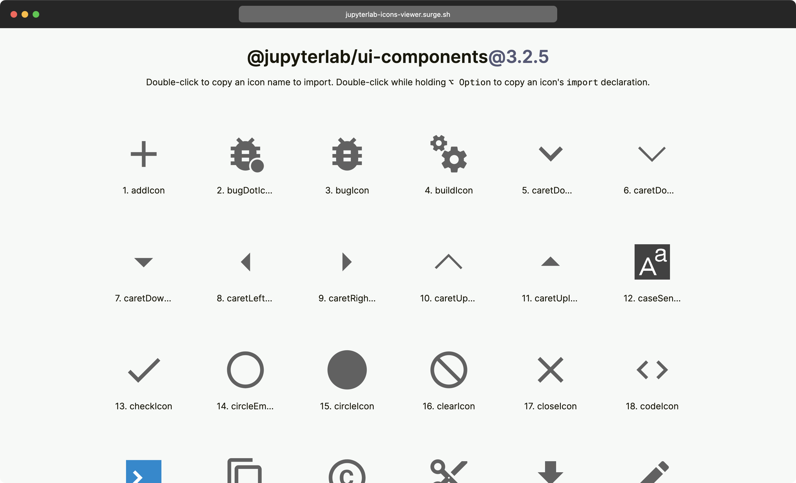

# jupyterlab-icons-viewer

## Development

- `npm install`
- `npm run dev`

## Deployment ([Surge](https://surge.sh/))

- `npm install -g surge` (if needed)
- `npm run build`
- `surge dist`
- Domain: https://jupyterlab-icons-viewer.surge.sh/

## Notes

- `npm create vite@latest jupyterlab-icons-viewer -- --template react`
- `npm install --save-dev vite @vitejs/plugin-react prettier prettier-config-standard`
- `npm install react react-dom`
- [prettier-config-standard](https://github.com/npetruzzelli/prettier-config-standard)
- `npm install @christiankaindl/lyts` or `npm install @christiankaindl/lyts@1.2.0-beta.3` ([npm](https://www.npmjs.com/package/@christiankaindl/lyts/v/1.2.0-beta.3))
- `npm install @jupyterlab/ui-components@3.2.5` ([npm](https://www.npmjs.com/package/@jupyterlab/ui-components/v/3.2.5))
- [@jupyterlab/ui-components](https://github.com/jupyterlab/jupyterlab/tree/v3.2.5/packages/ui-components) (v3.2.5)
- [React Recipes](https://github.com/craig1123/react-recipes) package (`npm install react-recipes`)
- [react-use-clipboard](https://github.com/danoc/react-use-clipboard) package (`npm install react-use-clipboard`)
- [usehooks-ts](https://github.com/juliencrn/usehooks-ts) package (`npm install usehooks-ts`)
- [react-device-detect](https://github.com/duskload/react-device-detect) package (`npm install react-device-detect`)
- [React Haiku](https://github.com/DavidHDev/react-haiku) package (`npm install react-haiku`)
- Browser for screenshots: [Confectionery](https://confectioneryapp.com/)
